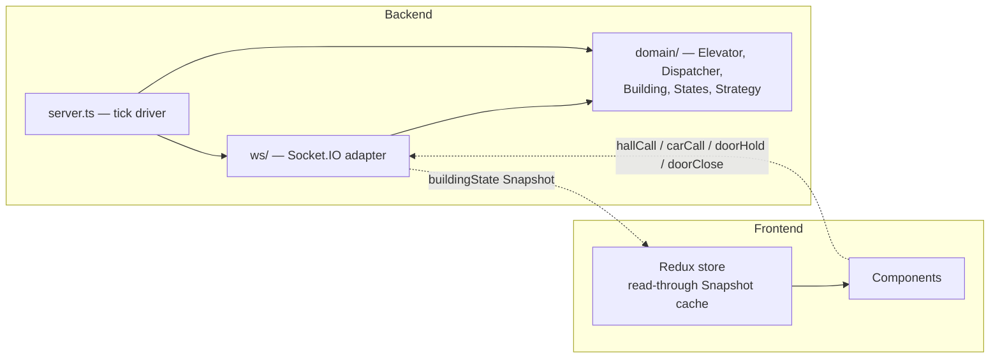

# Architecture Spine — Elevator Simulator

## Design Paradigm

**Hexagonal core, server-authoritative.** The domain (`Elevator`, `Dispatcher`, `Building`, the `ElevatorState` hierarchy, `SchedulingStrategy`) is a pure hexagon with zero transport or UI knowledge. `ws/` is the one adapter wrapping it for this build. The client is not part of the hexagon at all — it holds no simulation logic, only a read-through cache (Redux) of the server's latest Snapshot.



Alternatives weighed: plain server-authoritative naming alone (didn't fix the backend's internal boundary); plain layered (weaker enforcement of the domain-purity/testability requirement). Hexagonal was chosen because the dependency-direction rule below is exactly what a hexagon enforces, and it is the concrete mechanism behind the PRD's testability NFR.

## Invariants & Rules

### AD-1 — Domain core has zero transport/UI dependency `[ADOPTED]`

- **Binds:** all backend and frontend code
- **Prevents:** domain logic acquiring a Socket.IO or React dependency (breaking isolated unit-testability); the client computing Elevator/Building state itself and diverging from the server across tabs or reconnects
- **Rule:** `domain/` may import nothing from `ws/`, `server.ts`, React, or Redux. `ws/` depends on `domain/`, never the reverse. The client never derives Elevator/Building state locally — it only renders the latest Snapshot received over the wire. Client-side interpolation/animation of a Snapshot value's *presentation* (e.g. smoothly tweening a car's rendered pixel position between two ticks) is permitted and is not "deriving state" — it is rendering-only, never written back to Redux or read by application logic, and it reverts to the authoritative value on the next Snapshot.

### AD-2 — Elevator state is mutated only through itself

- **Binds:** `Elevator`, the `ElevatorState` hierarchy, `Dispatcher`
- **Prevents:** two callers (a WS handler and the simulation tick) racing to write the same field directly, producing inconsistent state; two devs both implementing the same transition (e.g. door-timer expiry) in different locations and double-firing it; a caller unable to tell whether a command was accepted
- **Rule:** `Elevator`'s internal fields (`currentFloor`, `direction`, `doorState`, `stopQueue`) are mutated only from within `Elevator`'s own methods or its current `ElevatorState`'s handlers (`onTick`, `onArriveFloor`, `onHallAssigned`). Each field-transition has exactly one designated writer: routine transitions (movement, door timing) are owned by the current `ElevatorState` handler; `Elevator`'s own methods are limited to public command entry points that delegate to `this.state`, never duplicating transition logic themselves. Every public command (`assignHallCall`, `assignCarCall`, `openDoor`, `closeDoor`) returns a result indicating whether it was accepted, so `Dispatcher`/`ws/` never have to guess. `Dispatcher` and `ws/` call only these public commands — never touch a field.

### AD-3 — Snapshot replaces, never merges

- **Binds:** Redux store, `ws/` broadcast
- **Prevents:** the client store patching in partial updates and drifting from server truth over successive ticks; a stale, reordered Snapshot (e.g. on reconnect) silently overwriting fresher state; a UI-only flag placed in the same slice as Snapshot data getting wiped by every replace
- **Rule:** every `buildingState` event fully replaces the corresponding Redux slice. No reducer may merge or carry forward fields across two Snapshots. This rule applies only to slices that are 1:1 with the wire Snapshot shape (e.g. `buildingSlice`) — client-only UI state (e.g. which panel is expanded) lives in a separate slice or component-local state that a Snapshot replace never touches. The reducer drops any incoming Snapshot whose `tick` sequence number (AD-4) is not strictly greater than the one currently stored, guarding against out-of-order delivery on reconnect.

### AD-4 — `shared/` is the single source of the wire contract

- **Binds:** `ElevatorSnapshot`, `BuildingSnapshot`, all WS event payload types
- **Prevents:** backend and frontend hand-copying type definitions and silently drifting apart; a one-sided type change merging without its paired call-site update
- **Rule:** the `shared` workspace package is the only place `ElevatorSnapshot`, `BuildingSnapshot`, and WS event payload types are defined. Both `backend` and `frontend` import them from `shared` — neither redefines them locally. `shared/` is backend-owned: a PR changing a `shared/` type must include its corresponding backend call-site change in the same commit; a frontend-only PR to a `shared/` type is not mergeable alone. `BuildingSnapshot` includes a monotonically increasing `tick` sequence number, used by AD-3's ordering guard.

### AD-5 — Dispatcher depends on the Strategy interface, never a concrete class `[ADOPTED]`

- **Binds:** `Dispatcher`, `SchedulingStrategy`, `NearestCarStrategy`
- **Prevents:** the polymorphism the OOP requirement is graded on collapsing into a disguised switch-case
- **Rule:** `Dispatcher` holds a `SchedulingStrategy` reference and calls only its interface method. It never branches on the concrete strategy's type or name — true even with a single shipping implementation (`NearestCarStrategy`; see PRD Non-Goals). Car Call intentionally never touches `Dispatcher`/`SchedulingStrategy` at all — it is an in-cabin destination add with no elevator-selection decision (`docs/ARCHITECTURE.md` §4), so the Strategy seam applies only to Hall Call dispatch. This is a deliberate scope boundary, not a gap.

### AD-6 — Stop Queue insertion and removal each go through exactly one method, and preserve direction-order

- **Binds:** `Elevator.stopQueue`
- **Prevents:** a naive unsorted insert that lets an Elevator skip a floor and have to backtrack for it (PRD FR-9's no-overshoot guarantee); Hall Call and Car Call insertion drifting into two different orderings; duplicate/stale entries; an uncoordinated second removal path
- **Rule:** Both `assignHallCall` and `assignCarCall` insert through the same private `insertStop(floor)` method — no second insertion code path exists. `insertStop` no-ops a floor equal to `currentFloor` while `doorState !== 'CLOSED'`, and de-duplicates a floor already queued. When inserting into an empty queue while `Direction === 'IDLE'`, the first inserted stop sets the Elevator's `Direction`; further same-tick inserts are ordered relative to that newly-set `Direction`. Removal is equally centralized: exactly one method, `completeStop(floor)`, called only from the arrival handler (`onArriveFloor`), is the sole way an entry leaves `stopQueue` — no other method, including `closeDoor`, removes queue entries.

### AD-7 — Pending Call re-evaluation is a single pull-based pass, once per tick, after every Elevator has ticked

- **Binds:** `Dispatcher.reevaluatePending`, `Building.tick`
- **Prevents:** `reevaluatePending` racing an in-flight Elevator transition, or running more than once per tick and double-assigning the same Pending Call; an Elevator pushing a callback/event to the Dispatcher mid-loop, reopening that race under a different name; non-reproducible dispatch outcomes when multiple elevators/calls become eligible in the same tick
- **Rule:** `Building.tick()` calls each Elevator's `tick()` first, in a fixed array order (fixed for determinism/testability — see AD-8 for why no correctness property depends on it), then calls `Dispatcher.reevaluatePending()` exactly once at the end of that same tick. `reevaluatePending` is strictly pull-based: it reads elevator state only after all ticks complete. No `Elevator` method pushes a callback/event to `Dispatcher` during `Building.tick()`'s per-elevator loop — the loop is elevator-local, Dispatcher reacts only at tick-end, never mid-loop. Within `reevaluatePending`, Pending Calls are iterated in FIFO arrival order, elevators in fixed array order, and `strategy.selectElevator` is invoked fresh once per call against the current candidate set, so dispatch outcomes are reproducible for the same input.

### AD-8 — Elevators share no mutable state; Building iterates them sequentially

- **Binds:** `Building`, `Elevator` (all 3 instances), `Dispatcher`/`SchedulingStrategy` reads
- **Prevents:** one Elevator's tick corrupting, blocking, or reading another's internal state (PRD FR-15's independence guarantee); ambiguity over whether Strategy dispatch decisions read live mutable objects or safe read-only data
- **Rule:** each `Elevator` instance owns only its own fields; no `Elevator`'s transition ever reads or writes another `Elevator`'s state. `SchedulingStrategy`/`Dispatcher` may read elevators via their public read-only accessors during dispatch decisions — this is Dispatcher-to-Elevator reading, not Elevator-to-Elevator, and doesn't cross the AD-4 wire boundary. `Building.tick()` iterates the elevators array in the fixed order AD-7 specifies; that order exists for determinism/testability, not because any correctness property depends on visitation order — elevators are mutually isolated regardless of order.

## Consistency Conventions

| Concern | Convention |
| --- | --- |
| Naming (entities, files, interfaces, events) | Class/type names match the PRD Glossary verbatim: `Elevator`, `ElevatorState`, `MovingState`, `IdleState`, `MovingUpState`, `MovingDownState`, `DoorOpenState`, `Dispatcher`, `SchedulingStrategy`, `NearestCarStrategy`, `PendingCall`, `StopQueue`, `Snapshot`, `Building`. WS event names: `hallCall`, `carCall`, `doorHold`, `doorClose` (client→server), `buildingState` (server→client). |
| Data & formats (ids, dates, error shapes, envelopes) | Floors are 1-indexed integers, 1-10. `Direction`: `'UP' \| 'DOWN' \| 'IDLE'`. `DoorState`: `'OPEN' \| 'OPENING' \| 'CLOSING' \| 'CLOSED'`. No WS error envelope: an invalid client action (e.g. a Car Call to the current floor) is a silent server-side no-op, never a thrown/emitted error — keeps the client dumb per AD-1. |
| State & cross-cutting (mutation, errors, logging, config, auth) | One tick loop (`Building.tick()`, `setInterval`, ~500ms) is the sole driver of movement and door timing; every other entry point funnels through AD-2. On WS `connect`, the server immediately emits a full `buildingState` Snapshot to that client — a joining or reconnecting client is never blank until the next scheduled tick. No auth/session layer (PRD Non-Goals). No persistence — process memory only; a restart resets the Building (PRD Non-Goals). |
| Container networking (docker-compose) | The frontend's Nginx container proxies WebSocket/API traffic to the backend via Compose's internal service-name DNS (e.g. `proxy_pass http://backend:<port>`) — never a hardcoded IP or `localhost` inside a container. |

## Stack

| Name | Version |
| --- | --- |
| Node.js | 24 LTS "Krypton" (24.21.0) |
| TypeScript | latest 5.x line (^5.9) — not 7.0.x, see memlog for the stability rationale |
| React | 19.3.0 |
| Vite | 8.3.0 (React's current recommended starter; create-react-app is deprecated) |
| Redux Toolkit | 2.12.0 |
| react-redux | 9.3.0 (confirmed React 19-compatible) |
| Socket.IO (server + client) | 4.8.3 |
| Vitest | 5.0.1 (backend and frontend unit tests — pairs natively with Vite) |
| Docker Compose | `docker compose` CLI plugin (v2 syntax) — omit the compose-file `version:` key, deprecated |
| Nginx (frontend container) | `nginx:1.30-alpine` (1.30.5, current stable Docker Hub tag) |

## Structural Seed

```text
elevator-simulator/
  package.json          # npm workspace root
  shared/
    src/
      snapshot.ts        # ElevatorSnapshot, BuildingSnapshot
      events.ts           # WS event payload types (AD-4)
  backend/
    src/
      domain/
        Direction.ts
        DoorState.ts
        Elevator.ts
        states/            # ElevatorState (abstract), IdleState, MovingState (abstract),
                            # MovingUpState, MovingDownState, DoorOpenState
        scheduling/         # SchedulingStrategy (interface), NearestCarStrategy
        Dispatcher.ts
        Building.ts
      ws/
        socketHandlers.ts  # the one adapter (AD-1)
      server.ts             # tick driver
    Dockerfile
  frontend/
    src/
      store/                # Redux Toolkit slices (AD-3)
      hooks/
        useBuildingSocket.ts
      components/
        BuildingView.tsx
        FloorHallPanel.tsx
        ElevatorShaft.tsx
        ElevatorCar.tsx
        DestinationPanel.tsx
      App.tsx
    Dockerfile
    nginx.conf
  docker-compose.yml
  docs/
    ARCHITECTURE.md         # superseded by this spine for invariants; retained for full seed detail
```

## Capability → Architecture Map

| Capability / Area | Lives in | Governed by |
| --- | --- | --- |
| Hall Call (PRD F1) | `domain/Dispatcher.ts`, `ws/socketHandlers.ts` | AD-1, AD-2 |
| Car Call (PRD F2) | `domain/Elevator.ts` | AD-2 |
| Door Control (PRD F3) | `domain/states/DoorOpenState.ts` | AD-2 |
| Dispatch Engine (PRD F4) | `domain/Dispatcher.ts`, `domain/scheduling/` | AD-2, AD-5, AD-6, AD-7 |
| Elevator State Machine (PRD F5) | `domain/states/` | AD-1, AD-2 |
| Real-time Sync (PRD F6) | `ws/socketHandlers.ts`, `frontend/store/` | AD-1, AD-3, AD-4 |
| Multi-elevator Coordination (PRD F7) | `domain/Building.ts` | AD-8 |
| Client State Management (PRD F8) | `frontend/store/` | AD-3, AD-4 |
| Containerization (PRD F9) | `backend/Dockerfile`, `frontend/Dockerfile`, `frontend/nginx.conf`, `docker-compose.yml` | Stack |

## Deferred

- **Deployment target beyond local Docker Compose** (cloud hosting, CI/CD pipeline) — out of scope; PRD Non-Goals excludes production/scaling concerns entirely.
- **Round-Robin or any second `SchedulingStrategy` implementation** — AD-5 keeps the seam open; PRD Non-Goals excludes building a second one now.
- **Hall-call merge optimization and max-hold-time cap** — PRD §6.2, explicitly optional hardening, not architected here.
- **Story-level detail inside `domain/states/` and `domain/scheduling/`** (exact method signatures, tick-loop pseudocode) — lives in `docs/ARCHITECTURE.md`, which this spine treats as implementation-level seed, not a place for new invariants.
