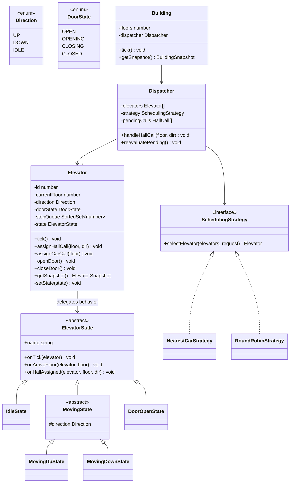
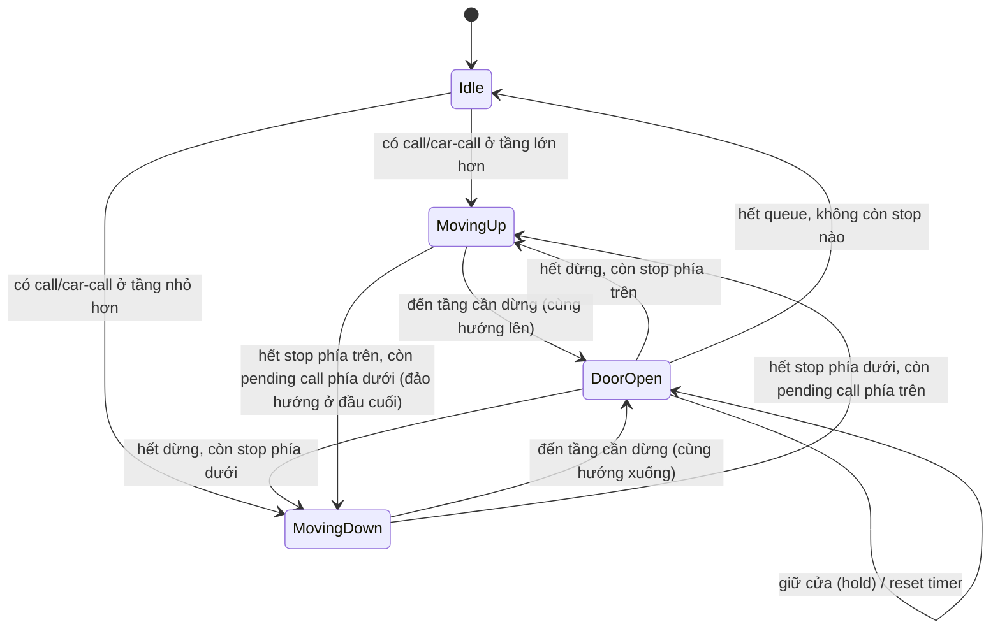

# Elevator Simulator — Architecture Design

> Tài liệu thiết kế chiến lược cho bài test Node.js Interview (3 elevators, 10 floors).
> Stack: **Node.js + TypeScript** (backend), **React + TypeScript** (frontend), **Socket.IO** (real-time).

## 1. Tóm tắt đề bài

- Tòa nhà 10 tầng, 3 thang máy hoạt động song song.
- Bấm ↑/↓ ở một tầng → hệ thống **tự chọn** thang máy phù hợp đến đón (hall call).
- Thang máy đang di chuyển chỉ dừng lại nếu tầng đó **cùng hướng** với hướng đang chạy (quy tắc SCAN/LOOK kinh điển).
- Sau khi thang máy tới, chọn tầng đích bên trong (car call).
- Nút giữ cửa mở / đóng cửa ngay.
- Phải thể hiện OOP: encapsulation, inheritance, polymorphism.

## 2. Domain model (OOP core)



### Vì sao thiết kế này thể hiện đủ 3 tính chất OOP

- **Encapsulation**: `Elevator` giữ toàn bộ state (`currentFloor`, `direction`, `doorState`, `stopQueue`) là **private**; bên ngoài chỉ tương tác qua method công khai (`assignHallCall`, `openDoor`, `getSnapshot`...). Không component nào được sửa trực tiếp field nội bộ.
- **Inheritance**: `ElevatorState` là abstract base, các state cụ thể (`IdleState`, `MovingUpState`, `MovingDownState`, `DoorOpenState`) kế thừa và override hành vi. `MovingUpState`/`MovingDownState` còn kế thừa tiếp từ `MovingState` (dùng chung logic di chuyển, khác nhau hướng).
- **Polymorphism**: `Elevator.tick()` gọi `this.state.onTick(this)` — hành vi thực thi khác nhau tùy runtime type của `state`, code gọi không cần biết đang ở state nào (state pattern). Tương tự, `Dispatcher` gọi `strategy.selectElevator(...)` — có thể đổi `NearestCarStrategy` ↔ `RoundRobinStrategy` mà không sửa `Dispatcher` (strategy pattern, mở/đóng theo OCP).

> Gợi ý khi trình bày: nhấn vào **State pattern + Strategy pattern** — đây là 2 design pattern kinh điển, dùng đúng chỗ sẽ rất "ăn điểm" khi hỏi về OOP thay vì chỉ có class rỗng kế thừa cho có.

## 3. State machine của một thang máy



Door dwell: khi vào `DoorOpen`, khởi động timer (ví dụ 3s tick). Nhấn **hold** (◁▷) reset timer. Nhấn **close** (▷◁) chuyển ngay sang tick đóng cửa → tính lại state kế tiếp.

## 4. Thuật toán điều phối: SCAN/LOOK + Nearest-Car

**Car call** (chọn tầng đích từ trong cabin): thêm trực tiếp vào `stopQueue` của elevator đó theo đúng hướng hiện tại — không cần dispatcher vì hành khách đã ở trong xe.

**Hall call** (bấm ↑/↓ ở tầng): `Dispatcher` chọn elevator theo chi phí:

```
function selectElevator(elevators, floor, requestDir):
  best = null; bestCost = Infinity
  for e in elevators:
    if e.state == Idle:
      cost = abs(e.currentFloor - floor)
    else if e.direction == requestDir and isAhead(e, floor, requestDir):
      // đang chạy cùng hướng và tầng gọi ở phía trước → có thể ghé dọc đường
      cost = abs(e.currentFloor - floor)
    else:
      // đang chạy ngược hướng, hoặc cùng hướng nhưng đã đi qua tầng đó
      continue  // không đủ điều kiện phục vụ NGAY, để lại pending

    if cost < bestCost:
      bestCost = cost; best = e

  if best != null:
    best.assignHallCall(floor, requestDir)
  else:
    pendingCalls.push({floor, requestDir})  // chờ elevator nào đó Idle hoặc đảo hướng

// Gọi lại mỗi khi 1 elevator chuyển sang Idle hoặc đảo hướng:
function reevaluatePending():
  for call in pendingCalls (copy):
    tryAssign(call)  // dùng lại selectElevator; nếu thành công thì remove khỏi pending
```

`isAhead(elevator, floor, dir)`: `dir == UP ? floor > elevator.currentFloor : floor < elevator.currentFloor`.

Điều này đúng khớp với ví dụ trong đề: đang ở tầng 5, thang máy đi lên 1→10 → bấm ↑ ở tầng 5 hợp lệ (cùng hướng, ở phía trước) → ghé; bấm ↓ ở tầng 5 không hợp lệ ngay (ngược hướng dự kiến của hành khách so với hướng hiện tại của cabin) → vào `pendingCalls`, chờ thang máy lên tới tầng 10, đảo hướng xuống, `reevaluatePending()` sẽ gán lại.

> Khi trình bày, nên nói rõ đây là **greedy nearest-car trong LOOK algorithm** — không phải optimal toàn cục (NP-hard nếu muốn tối ưu tuyệt đối), nhưng là chuẩn công nghiệp thực tế (Otis, KONE dùng biến thể của thuật toán này) và đủ tốt cho scope bài test.

## 5. Kiến trúc hệ thống

```
[React Client] <==WebSocket (Socket.IO)==> [Node.js Server]
                                                 |
                                        Building.tick() loop
                                         (setInterval, vd 500ms/tick)
                                                 |
                                        Dispatcher -> Elevator[] (state machine)
```

- Backend chạy một **simulation loop** duy nhất (nguồn sự thật duy nhất - single source of truth), không có state ở client.
- Mỗi tick: `Building.tick()` → mỗi `Elevator.tick()` (di chuyển, mở/đóng cửa, đổi state) → sau tick, server **broadcast snapshot** toàn bộ building qua WebSocket.
- Client chỉ gửi **lệnh** (hall call, car call, door hold/close) và **render** snapshot nhận được — không tự tính toán vị trí/trạng thái (tránh lệch state giữa nhiều client nếu mở nhiều tab).

### WebSocket contract

Client → Server:
| Event | Payload | Ý nghĩa |
|---|---|---|
| `hallCall` | `{ floor: number, direction: 'UP'\|'DOWN' }` | Gọi thang máy tới tầng |
| `carCall` | `{ elevatorId: number, floor: number }` | Chọn tầng đích trong cabin |
| `doorHold` | `{ elevatorId: number }` | Giữ cửa mở |
| `doorClose` | `{ elevatorId: number }` | Đóng cửa ngay |

Server → Client:
| Event | Payload | Khi nào |
|---|---|---|
| `buildingState` | `BuildingSnapshot` (full state) | Ngay khi client connect, và mỗi tick sau đó |

Với quy mô nhỏ (3 elevator × 10 tầng), broadcast full snapshot mỗi tick đơn giản và đủ rẻ — không cần optimize diff.

```ts
type ElevatorSnapshot = {
  id: number
  currentFloor: number
  direction: 'UP' | 'DOWN' | 'IDLE'
  doorState: 'OPEN' | 'OPENING' | 'CLOSING' | 'CLOSED'
  destinations: number[] // stop queue hiện tại, để UI hiển thị
}

type BuildingSnapshot = {
  floors: number
  elevators: ElevatorSnapshot[]
  pendingHallCalls: { floor: number; direction: 'UP' | 'DOWN' }[] // để sáng đèn nút gọi
}
```

## 6. Cấu trúc thư mục đề xuất

```
/backend
  /src
    domain/
      Direction.ts
      DoorState.ts
      Elevator.ts
      states/
        ElevatorState.ts        (abstract)
        IdleState.ts
        MovingState.ts          (abstract, extends ElevatorState)
        MovingUpState.ts
        MovingDownState.ts
        DoorOpenState.ts
      scheduling/
        SchedulingStrategy.ts   (interface)
        NearestCarStrategy.ts
      Dispatcher.ts
      Building.ts
    ws/
      socketHandlers.ts
    server.ts
  package.json
/frontend
  /src
    hooks/
      useBuildingSocket.ts
    components/
      BuildingView.tsx
      FloorHallPanel.tsx        (nút gọi ↑/↓ theo tầng, đèn báo pending)
      ElevatorShaft.tsx         (1 cột / elevator, hiển thị vị trí + hướng)
      ElevatorCar.tsx           (cabin, cửa, animation)
      DestinationPanel.tsx      (hiện khi cửa mở tại 1 tầng: chọn đích, hold/close)
    types/
      shared.ts                (copy hoặc symlink type từ backend)
    App.tsx
  package.json
/docs
  ARCHITECTURE.md               (file này)
  BAT-Node.js - Interview Test-...pdf
```

> Cân nhắc dùng npm workspace hoặc đơn giản là 2 folder độc lập với `shared/` chứa type dùng chung cho cả 2 phía (tránh lệch contract khi sửa 1 bên quên sửa bên kia).

## 7. Vòng đời một request (end-to-end)

1. User bấm ↑ ở tầng 5 trên UI → client emit `hallCall({floor:5, direction:'UP'})`.
2. Server: `Dispatcher.handleHallCall` chạy `NearestCarStrategy.selectElevator` → gán cho elevator #2, gọi `elevator.assignHallCall(5, 'UP')` → thêm 5 vào `stopQueue`, nếu đang Idle thì chuyển sang `MovingUpState`/`MovingDownState`.
3. Mỗi tick, `elevator.tick()` di chuyển 1 bước; khi `currentFloor` khớp một stop trong queue **và** hướng khớp → `setState(DoorOpenState)`, mở cửa, khởi động dwell timer, remove khỏi queue.
4. Server broadcast `buildingState` → UI cập nhật vị trí cabin, đèn báo tầng đang dừng.
5. User trong cabin bấm tầng 9 → client emit `carCall({elevatorId:2, floor:9})` → thêm 9 vào `stopQueue` theo đúng hướng.
6. Dwell timer hết (hoặc user bấm ▷◁ đóng ngay) → cửa đóng → elevator tiếp tục theo state tiếp theo (`MovingUpState` nếu còn stop phía trên, ngược lại đảo hướng hoặc `IdleState`).
7. Khi elevator chuyển sang Idle hoặc đảo hướng, `Dispatcher.reevaluatePending()` chạy lại để gán các hall call đang chờ (ví dụ tầng 5 bấm ↓ trước đó khi elevator đang đi lên).

## 8. Edge cases cần xử lý (đáng nhắc khi present)

- Nhiều hall call cùng lúc ở nhiều tầng khác hướng nhau → mỗi lần `handleHallCall` chạy độc lập, `reevaluatePending` đảm bảo không "rớt" request nào.
- Hall call ở đúng tầng elevator đang đứng mở cửa, cùng hướng dự định kế tiếp → có thể merge vào lần dừng hiện tại (tối ưu, không bắt buộc).
- Bấm hold liên tục → chỉ reset timer, không cho phép mở cửa vô hạn (có thể đặt max hold time nếu muốn chặt hơn, tùy chọn).
- Tất cả 3 elevator đều bận / đi ngược hướng → request vào `pendingCalls`, không bị mất, được xử lý lại ở lần `reevaluatePending` gần nhất.
- Elevator đã có `stopQueue` rất dài (nhiều car call) → cần đảm bảo `stopQueue` là sorted set theo đúng hướng hiện tại để không đi lố tầng rồi phải quay lại.

## 9. Testing strategy gợi ý

- Unit test cho `NearestCarStrategy.selectElevator` với các case: elevator idle gần nhất, elevator đang chạy cùng hướng phía trước, elevator ngược hướng (phải bị loại), tất cả elevator không phù hợp (phải rơi vào pending).
- Unit test cho từng `ElevatorState` (đặc biệt `MovingUpState`/`MovingDownState`): đảm bảo chỉ dừng khi tầng nằm trong `stopQueue` và cùng hướng.
- Integration test nhỏ cho `Building.tick()` chạy nhiều tick liên tiếp, kiểm tra snapshot cuối cùng đúng như kỳ vọng (không cần UI).
